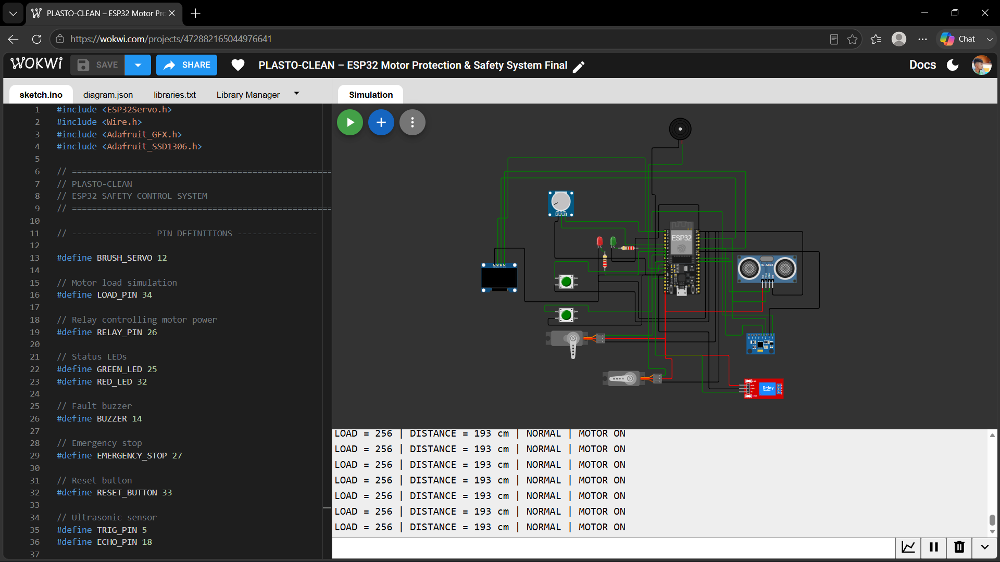

# 🚜 PLASTO-CLEAN – ESP32 Motor Protection & Safety System

An **ESP32-based safety-control prototype** developed as part of the **PLASTO-CLEAN tractor-mounted plastic removal system**.

The prototype focuses on monitoring operating conditions and providing automatic motor/brush shutdown when potentially unsafe conditions such as **motor overload, obstacle detection, or emergency-stop activation** are detected.

The control logic has been designed, implemented, and tested using **Wokwi ESP32 simulation**.

---

## 🔎 Project Overview

**PLASTO-CLEAN** is a proposed tractor-mounted system intended to assist in removing plastic waste trapped around:

* Wire-mesh fences
* Hedges and farm boundaries
* Ditches
* Agricultural areas
* Other difficult-to-access locations

The proposed mechanical system uses a brush/roller-based mechanism for collecting trapped plastic waste.

This ESP32 prototype represents the **electronic control and safety-monitoring layer** of the system.

---

## ⚙️ Prototype Features

The current simulation implements:

* ✅ Motor-load monitoring using an analog input
* ✅ Motor overload detection
* ✅ HC-SR04 ultrasonic obstacle detection
* ✅ Emergency-stop input
* ✅ Latched fault handling
* ✅ Safety-validated reset mechanism
* ✅ Servo-based brush mechanism simulation
* ✅ Relay-based motor power control
* ✅ Green/red operating-status indicators
* ✅ Audible fault buzzer
* ✅ 128×64 OLED status display
* ✅ Serial Monitor diagnostics
* ✅ Safe startup state
* ✅ Continuous safety monitoring during operation

The current Wokwi implementation contains the ESP32, ultrasonic sensor, potentiometer-based load simulation, relay, LEDs, buzzer, control buttons, OLED display, and servo mechanism.

---

## 🛡️ Safety Control Logic

The controller continuously monitors three primary safety conditions:

### 1. Motor Overload

A potentiometer is used to simulate motor load through the ESP32 ADC.

**Threshold:**

```text
Motor Load > 3500 ADC
```
When an overload is detected, the system:

1. Latches the fault
2. Stops the brush
3. Disconnects motor power through the relay
4. Turns ON the red LED
5. Activates the buzzer
6. Displays `OVERLOAD FAULT` on the OLED
7. Keeps the system in the fault state until a valid reset is performed

The overload threshold is defined in the firmware as:

```cpp
#define OVERLOAD_LIMIT 3500
```

---

### 2. Obstacle Detection

An **HC-SR04 ultrasonic sensor** is used to simulate detection of an obstacle in front of the mechanism.

**Threshold:**

```text
Distance ≤ 10 cm
```

When an obstacle is detected, the system:

1. Latches the fault
2. Stops the brush
3. Cuts motor power
4. Activates the fault indication
5. Activates the buzzer
6. Displays `OBSTACLE DETECTED`
7. Keeps motor power OFF until the obstacle is cleared and a valid reset is performed

The obstacle threshold is defined as **10 cm** in the current simulation.

---

### 3. Emergency Stop

The emergency-stop button is configured using an internal pull-up and is connected to **GPIO 27**.

When activated, the controller:

* Latches the safety fault
* Stops the brush
* Cuts motor power
* Turns OFF the green status indication
* Turns ON the red fault LED
* Activates the buzzer
* Displays `EMERGENCY STOP`
* Prevents normal operation until the emergency stop is released and a valid reset is performed

**Important:** Releasing the emergency-stop button alone does **not** clear the latched fault.

---

## 🔄 Fault Latching & Reset

A key feature of the prototype is the **latched fault mechanism**.

Once a safety fault occurs, the controller does not automatically resume operation when a sensor value temporarily returns to normal.

Instead:

```text
Safety Fault
     ↓
Fault Latched
     ↓
Brush STOP
     ↓
Motor Power OFF
     ↓
Red LED + Buzzer
     ↓
Fault Displayed on OLED
     ↓
Operator Corrects Condition
     ↓
RESET Button
     ↓
Safety Conditions Checked
     ↓
Safe → Fault Cleared
Unsafe → Reset Rejected
```

The reset is accepted only when:

```text
Emergency Stop = Released
Motor Load = Safe
Obstacle = Not Detected
```

If any unsafe condition remains active, the reset is rejected and motor power remains OFF.

---

## 🖥️ OLED Status Display

A **128×64 SSD1306 OLED** provides operator feedback.

The prototype displays states such as:

```text
PLASTO-CLEAN
INITIALIZING...
```

```text
SYSTEM READY
Motor Power: OFF
```

```text
SYSTEM READY
Motor Power: ON
```

```text
OVERLOAD FAULT
Motor Power: OFF
```

```text
OBSTACLE DETECTED
Motor Power: OFF
```

```text
EMERGENCY STOP
Motor Power: OFF
```

The OLED uses I²C communication through:

* **GPIO 21 — SDA**
* **GPIO 22 — SCL**

---

## 🔌 Pin Configuration

| Component                | ESP32 GPIO | Purpose                    |
| ------------------------ | ---------: | -------------------------- |
| Brush Servo              |    GPIO 12 | Brush mechanism simulation |
| Motor Load Potentiometer |    GPIO 34 | Simulated motor-load input |
| Relay                    |    GPIO 26 | Motor power control        |
| Green LED                |    GPIO 25 | Normal operation           |
| Red LED                  |    GPIO 32 | Fault indication           |
| Buzzer                   |    GPIO 14 | Audible fault indication   |
| Emergency Stop           |    GPIO 27 | Emergency shutdown         |
| Reset Button             |    GPIO 33 | Fault reset                |
| HC-SR04 Trigger          |     GPIO 5 | Ultrasonic trigger         |
| HC-SR04 Echo             |    GPIO 18 | Ultrasonic echo            |
| OLED SDA                 |    GPIO 21 | I²C data                   |
| OLED SCL                 |    GPIO 22 | I²C clock                  |

These mappings correspond to the current firmware and Wokwi simulation.

---

## 📊 Prototype Parameters

| Parameter                   | Current Value |
| --------------------------- | ------------: |
| Motor overload threshold    |      3500 ADC |
| Obstacle detection distance |         10 cm |
| Brush operating position    |           90° |
| Brush stop position         |            0° |
| Fault buzzer frequency      |       2000 Hz |
| Serial communication        |   115200 baud |

> **Note:** These values are simulation/prototype parameters and require engineering validation before being applied to real machinery.

---

## 🧠 System Operating Flow

### Normal Operation

```text
ESP32 Startup
     ↓
Initialize Sensors & Outputs
     ↓
Safe Startup
     ↓
Monitor Load + Distance + Emergency Stop
     ↓
Safety Conditions Normal
     ↓
Motor Power Enabled
     ↓
Brush Servo Enabled
     ↓
Green LED ON
     ↓
OLED → SYSTEM READY
```

### Fault Condition

```text
Unsafe Condition Detected
          ↓
      Fault Latched
          ↓
      Brush STOP
          ↓
     Motor Power OFF
          ↓
   Red LED + Buzzer ON
          ↓
    Fault on OLED
          ↓
     System Remains OFF
```

### Reset

```text
RESET Button Pressed
          ↓
Safety Conditions Checked
          ↓
      ┌───────┴───────┐
      ↓               ↓
    SAFE            UNSAFE
      ↓               ↓
Fault Cleared    Reset Rejected
      ↓               ↓
Motor Ready      Motor Remains OFF
```

---

## 🧪 Wokwi Simulation

The complete ESP32 control prototype has been developed and tested in **Wokwi**.

### ▶️ Live Simulation

**PLASTO-CLEAN – ESP32 Motor Protection & Safety System Final**

[Open the Wokwi Simulation](https://wokwi.com/projects/472882165044976641)

The simulation demonstrates the interaction between the ESP32 controller, motor-load input, ultrasonic obstacle sensor, emergency stop, reset control, relay, servo, LEDs, buzzer, OLED display, and Serial Monitor.

---

## 📷 Simulation Preview



> The image shows the ESP32-based prototype with the OLED, ultrasonic sensor, load input, status LEDs, control buttons, servo mechanism, relay, and buzzer connected in the Wokwi environment.

---

## 📚 Libraries Used

The firmware uses the following Arduino libraries:

```text
ESP32Servo
Wire
Adafruit GFX Library
Adafruit SSD1306
```

The current Wokwi project includes these library dependencies.

---

## 📁 Project Structure

```text
PLASTO-CLEAN/
│
├── plasto_clean.ino
├── diagram.json
├── libraries.txt
├── wokwi_simulation.png
└── README.md
```

---

## 🚀 Development Status

### Current Status

**ESP32 Safety-Control Prototype – Simulation Validated**

### Completed

* [x] ESP32 control architecture
* [x] Motor-load simulation
* [x] Motor overload detection
* [x] HC-SR04 obstacle detection
* [x] Emergency-stop handling
* [x] Fault latching
* [x] Safety reset validation
* [x] Relay-based motor cutoff
* [x] Servo brush simulation
* [x] Red/green status indication
* [x] Audible fault indication
* [x] OLED status display
* [x] Serial diagnostics
* [x] Safe startup behavior
* [x] Wokwi simulation

### Future Development

* [ ] Physical ESP32 prototype
* [ ] Real motor-current/load sensing
* [ ] Hardware emergency-stop circuit
* [ ] Motor driver/relay hardware integration
* [ ] Mechanical brush/roller integration
* [ ] Hydraulic system integration
* [ ] Hardware-level fail-safe design
* [ ] Prototype enclosure
* [ ] Field testing
* [ ] Reliability and environmental testing

---

## ⚠️ Prototype Disclaimer

This project is currently an **engineering prototype and simulation**.

The Wokwi components represent the behavior of the proposed control system and do not replace properly rated industrial hardware.

Before integration with real agricultural machinery, the system would require appropriate:

* Electrical protection
* Isolation
* Emergency-stop hardware
* Motor protection
* Fail-safe design
* Mechanical safety provisions
* Hardware validation
* Field testing
* Professional engineering review

The current simulation should therefore be considered a **proof-of-concept for the embedded control and safety logic**, rather than a certified machine-safety controller.

---

## 🎯 Project Objective

The primary objective of this prototype is to demonstrate how an embedded controller can combine multiple safety inputs into a coordinated motor-protection system:

```text
MONITOR
   ↓
DETECT
   ↓
FAULT LATCH
   ↓
STOP MOTOR
   ↓
ALERT OPERATOR
   ↓
VERIFY SAFE CONDITION
   ↓
CONTROLLED RESET
```

This provides the foundation for the electronic safety-control layer of the proposed **PLASTO-CLEAN tractor-mounted plastic removal system**.

---

## 🔗 Project Links

### Wokwi Simulation

[Open PLASTO-CLEAN Wokwi Simulation](https://wokwi.com/projects/472882165044976641)

### GitHub Repository

This repository contains the ESP32 firmware, Wokwi configuration, library dependencies, simulation preview, and project documentation.

---

## 🛠️ Technology Stack

| Category            | Technology          |
| ------------------- | ------------------- |
| Microcontroller     | ESP32               |
| Firmware            | Arduino C/C++       |
| Simulation          | Wokwi               |
| Display             | SSD1306 OLED        |
| Distance Sensor     | HC-SR04             |
| Actuator Simulation | Servo Motor         |
| Motor Control       | Relay               |
| Load Simulation     | Potentiometer / ADC |
| Status Indication   | LEDs                |
| Fault Indication    | Buzzer              |
| Communication       | Serial + I²C        |

---

## ⭐ Key Takeaway

**PLASTO-CLEAN** demonstrates an embedded approach to monitoring machine operating conditions and responding to abnormal conditions through a coordinated safety-control sequence.

The current prototype establishes the foundation for progressing from:

**Simulation → Embedded Hardware Prototype → Mechanical Integration → System Validation**
